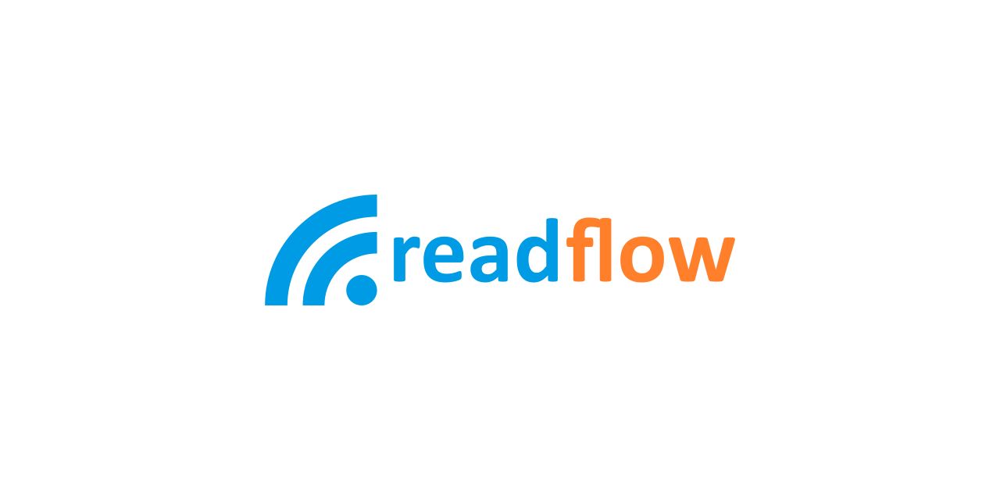

# readflow

[](https://github.com/ncarlier/readflow/actions/workflows/build.yml)
[](https://goreportcard.com/report/github.com/ncarlier/readflow)
[](https://hub.docker.com/r/ncarlier/readflow/)

Read your Internet article flow in one place with complete peace of mind and freedom.



## Features

- Read articles from anywhere in one place.
- Save articles for offline reading or locally on you disk in the format you want (HTML, PDF, EPUB, ZIP, ...).
- Create categories and classify new articles.
- Customize article integration with a scripting engine.
- Link with external services thanks to incoming and outgoing webhooks (Newsletter, [RSS][feedpushr], [Keeper][keeper], [Pocket][pocket], [Shaarli][shaarli], [Wallabag][wallabag], S3 bucket, and more...).
- Receive notifications when new articles are available.
- Enjoy the same user experience on mobile as on desktop thanks to [Progressive Web App][pwa] support.
- And all this without ads and trackers.

## Installation

Using Go compiler:

```bash
go install -v github.com/ncarlier/readflow@latest
```

**Or** using pre-compiled binary:

```bash
curl -sf https://gobinaries.com/ncarlier/readflow | sh
# or
curl -s https://raw.githubusercontent.com/ncarlier/readflow/master/install.sh | bash
```

**Or** using Docker:

```bash
docker run -it --rm \
  -p 8080:8080 \
  -e READFLOW_DATABASE_URI=<YOUR POSTGERSQL CONNECTION STRING> \
  ncarlier/readflow:edge
```

**Or** using Docker Compose:

```bash
docker compose up
```

> The default Docker Compose file mounts a passwd file with a `demo` user having `demo` as password.

## Configuration

Readflow configuration is a TOML file that you can specify using the `-c` command line parameter or by setting the `READFLOW_CONFIG` environment variable.

You can initialize a configuration file example by using the `init-config -f config.toml` command.

A configuration file example can be found [here](./internal/config/defaults.toml).

Type `readflow --help` to display available commands.

## UI

You can access Web UI on http://localhost:8080


## Documentation

The documentation can be found here: https://docs.readflow.app

## GraphQL API

You can explore the server API using GraphiQL endpoint: http://localhost:8080/graphiql

## Development

To be able to build the project you will need to:

- Install `makefiles` external helpers:
  ```bash
  $ git submodule init
  $ git submodule update
  ```

Then you can build the project using make:

```bash
$ make
```

Type `make help` to see other possibilities.

## Bakers

These amazing people have sponsored this project:

[](https://www.codelutin.com/)

[](https://www.paypal.me/nunux)

***

## Licenses

Readflow artworks except the logo are under the [Licence Creative Commons Attribution-NonCommercial-NoDerivatives 4.0](https://creativecommons.org/licenses/by-nc-nd/4.0/legalcode).
Attribution to [Maxime Belloche](https://www.instagram.com/bouloche61/)

Avatar artworks are under the [License Creative Commons Attribution 4.0](https://creativecommons.org/licenses/by/4.0/legalcode).
Attribution to [David Revoy](https://www.davidrevoy.com/)

Readflow is provided under the [GNU Affero General Public License Version 3 (AGPLv3)](https://github.com/ncarlier/readflow/blob/master/LICENSE).

```text
Readflow is a personal news reader service.

Copyright (C) 2021 Nicolas Carlier

This program is free software: you can redistribute it and/or modify
it under the terms of the GNU Affero General Public License as
published by the Free Software Foundation, either version 3 of the
License, or (at your option) any later version.

This program is distributed in the hope that it will be useful,
but WITHOUT ANY WARRANTY; without even the implied warranty of
MERCHANTABILITY or FITNESS FOR A PARTICULAR PURPOSE. See the
GNU Affero General Public License for more details.

You should have received a copy of the GNU Affero General Public License
along with this program.  If not, see <https://www.gnu.org/licenses/>
```

---

[pwa]: https://web.dev/progressive-web-apps
[feedpushr]: https://github.com/ncarlier/feedpushr
[keeper]: https://keeper.nunux.org
[wallabag]: https://www.wallabag.org
[shaarli]: https://github.com/shaarli/Shaarli
[pocket]: https://getpocket.com/
