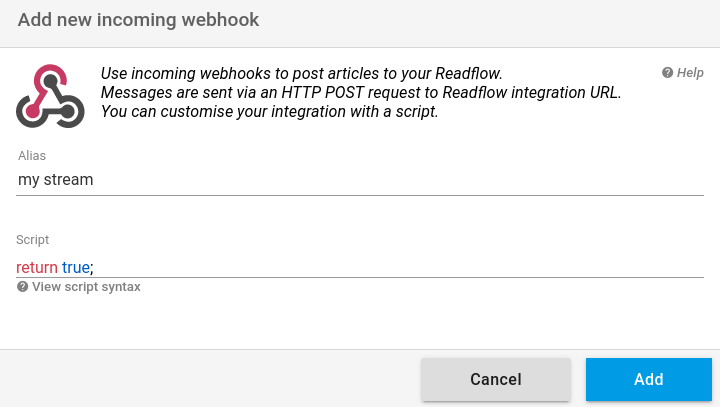

+++
title = "Incoming webhook"
description = "Add content to readflow from third-party services"
weight = 1
+++

An incoming webhook allows a third party service to create content in readflow.

To add an incoming webhook, go to [the integration configuration screen](https://readflow.app/settings/integrations).

Click the `Add` button to add an incoming webhook:

Enter an alias for your webhook.

The alias can be used by the rules engine to classify the articles coming through this webhook.

The service using the webhook must implement the [Integration API](integration-api):

{}
