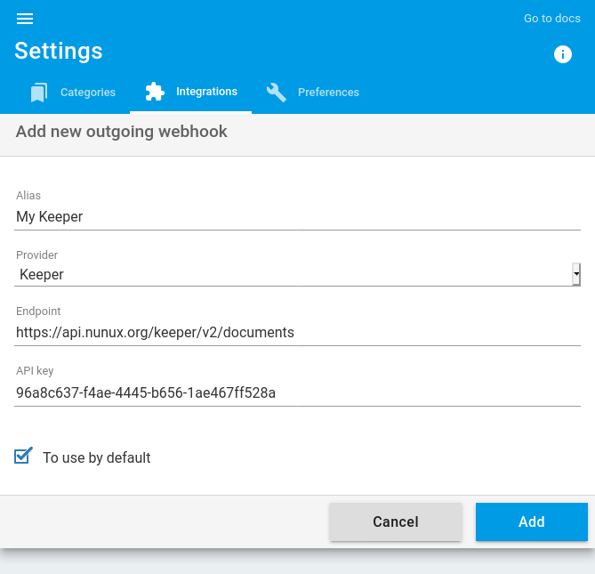

+++
title = "Nunux Keeper"
description = "Send articles to Nunux Keeper"
weight = 1
+++

[Nunux Keeper](https://keeper.nunux.org) is an Open Source article archiving service.

To use readflow with Nunux Keeper you must first obtain [an API key in Nunux Keeper](https://app.nunux.org/keeper/settings/api-key):

Once obtained, you can [configure your outgoing webhook](https://readflow.app/settings/integrations):

Click on the `Add` button to add an outgoing webhook.
The outgoing webhook creation page opens:

1. Enter an alias
1. Choose `Nunux Keeper` as provider
1. Configure the URL of the service if necessary
1. Paste your API key
1. Click on the checkbox if you want to make it your default service

The default archiving service can be invoked via the keyboard shortcut `s` when viewing an article.

Once configured, you will see a new entry in the context menu of the article.

You can now send an article to Nunux Keeper.
