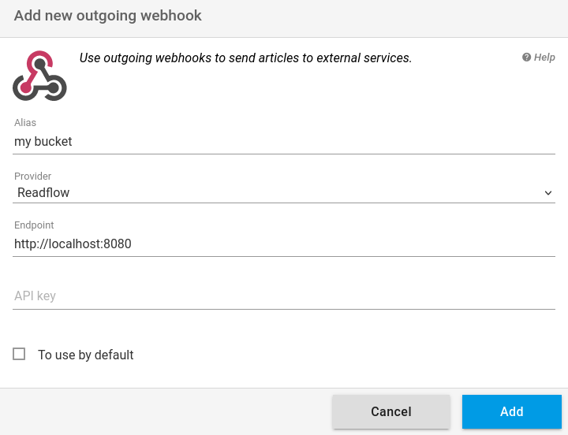

+++
title = "Readflow"
description = "Send articles to readflow"
weight = 3
+++

You can send articles to another readflow.
To do this, [configure your outgoing webhook](https://readflow.app/settings/integrations):

Click on the `Add` button to add an outgoing webhook.
The webhook add page opens:

1. Enter an alias
1. Choose `Readflow` as provider
1. Configure if needed the URL of the service
1. Set your API key from the incoming webhook
1. Click on the checkbox if you want to make it your default service

The default archiving service can be invoked via the keyboard shortcut `shift+s` when viewing an article.

Once configured, you will see a new entry in the context menu of the article.

You can now send an article to readflow.
