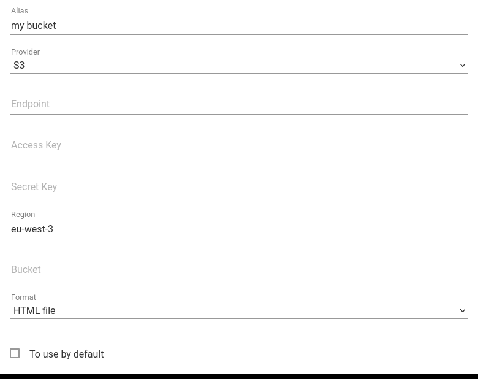

+++
title = "S3 Bucket"
description = "Send articles to S3 bucket"
weight = 3
+++

[A S3 bucket](https://en.wikipedia.org/wiki/Amazon_S3) is an online file storage service.

You can [configure your outgoing webhook](https://readflow.app/settings/integrations):

Click on the `Add` button to add an outgoing webhook.
The webhook add page opens:

1. Enter an alias
1. Choose `S3` as provider
1. Configure the URL of the service
1. Configure the credentials (Access and Secret Key)
1. Set your region
1. Set your bucket name
1. Choose the firl format
1. Click on the checkbox if you want to make it your default service

The default archiving service can be invoked via the keyboard shortcut `shift+s` when viewing an article.

Once configured, you will see a new entry in the context menu of the article.

You can now send an article to a S3 bucket.
