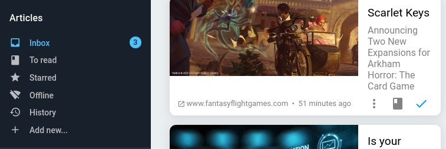
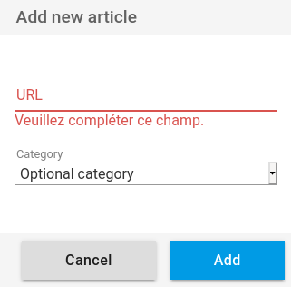

+++
title = "Add an article"
description = "Add an article from the web interface"
weight = 1
+++

You can add an item from the main menu:

Clicking on this button opens a window for adding a link:

Enter a valid link.
You can also specify a category.
If the page is readable it will be added to the reading flow.

A page can only be added once.

**Attention:** 
The page may not be readable by the content extraction system.
This is usually due to a deliberate obfuscation to prevent this kind of extraction.
In this case, only [Open Graph][open-graph] data are extracted.

[open-graph]: https://fr.wikipedia.org/wiki/Open_Graph_Protocol
