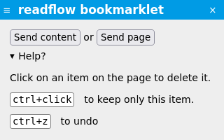

+++
title = "Bookmarklets"
description = "Add an article during web browsing using a bookmarklet"
weight = 4
+++

To create a bookmarklet, you must first have [created an incoming webhook](../../integrations/incoming-webhook).

Once the webhook has been created, you can drag the bookmarklet icon  into your browser's favorites.

You can rename the bookmarklet as you wish.

While browsing the web, if you are interested in a page, click on the link in your favorites.

A small window should appear on the page:

It allows you to send all or part of the page.
You can click on the elements of the page you are not interested in to remove them (or hold down the `ctrl` key to do the opposite).
