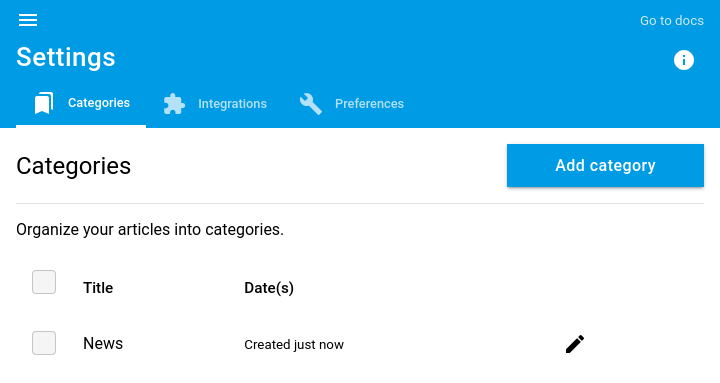

+++
title = "Categories"
description = "Use categories to organize your reading flows"
weight = 2
+++

In readflow you can split your reading flows into categories.

## Categories

To manage categories, go to [the configuration screen](https://readflow.app/settings/categories):

You can add a category by clicking on `Add category` button.

A category is defined by a simple title.

You can now assign an article to this category.
