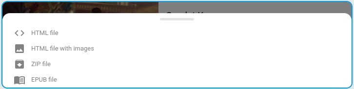

+++
title = "Download an article"
description = "Download an article from the web interface"
weight = 3
+++

It is possible to download an article on your device.
This allows you to consult or archive this article in complete freedom.

Click on the contextual menu to access the download button of an article:

You can then choose the file format that suits you:

