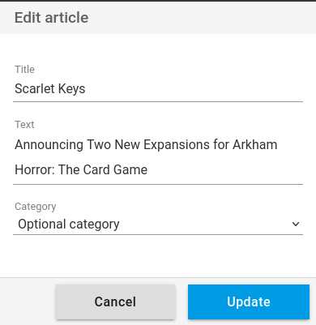

+++
title = "Edit an article"
description = "Edit an article from the web interface"
weight = 1
+++

It is possible to modify an article partially.
This allows you to improve its organization and to add your own notes.

Click on the contextual menu to access the edit button of an article:

You can then modify:

- the title
- the text
- and the category

