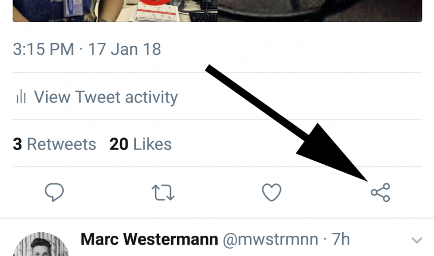
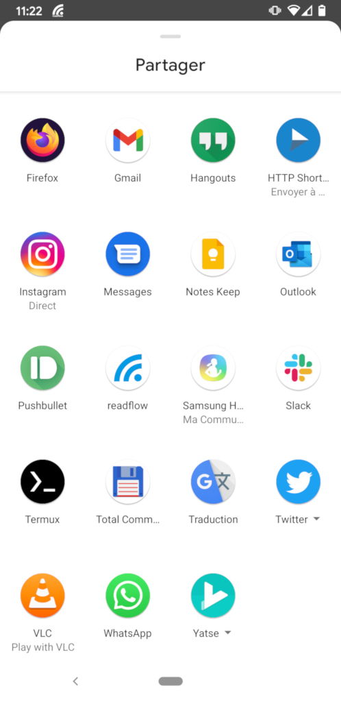
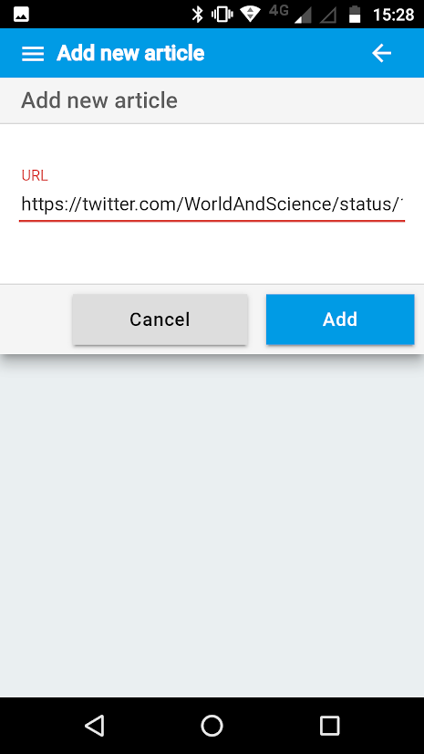

+++
title = "Add an article"
description = "Add content from another App"
weight = 1
+++

Once readflow is installed, you can send content from another app that offers sharing.

For example, under the Twitter app you can share a tweet:

If you click this button, you will open the Android sharing screen:

Click on the readflow icon and the application will open on the add screen with the link extracted from the shared content:

