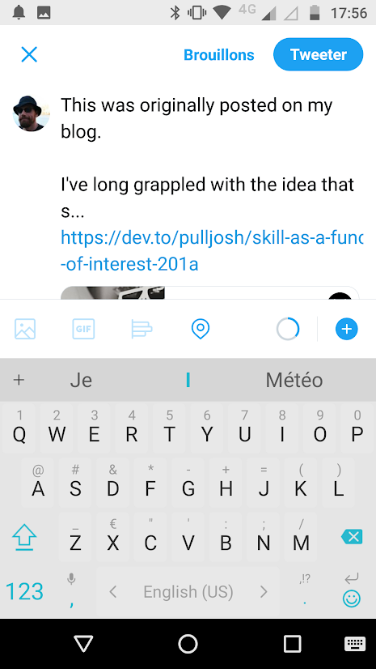

+++
title = "Share an article"
description = "Send an article to another app"
weight = 1
+++

Once readflow installed, you can send an article to another app.

Click on the context menu to access the sharing button for an article:

You can send the article to another app such as Twitter:

