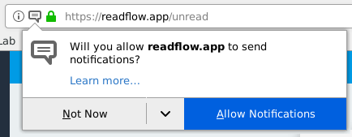

+++
title = "Notifications"
description = "Enable read flow notification"
weight = 6
+++

It is possible to receive notifications when the reading flow contains articles.

The first time you use readflow, your browser must ask you for permission to use notifications.
You must accept to be able to subscribe to notifications.

To subscribe to notifications, simply click on the small bell  on [the configuration screen](https://readflow.app/settings).
You can then click on it again to stop receiving notifications.

{}
Notifications are attached to the browser and device used.
If you change your browser or device, you must repeat the operation to receive notifications on it.
{}

You will then receive notifications as your reading flow fills up:

