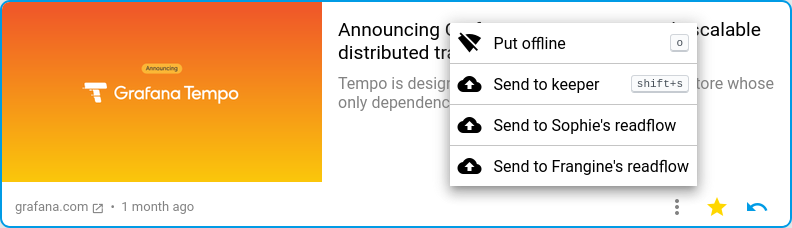

+++
title = "Offline mode"
description = "Usage of the offline mode"
weight = 5
+++

It is possible to keep an article in offline mode.
This allows you to read the article even if there no network coverage.

**Attention:**
There is currently no offline synchronization service.
The article is kept on the device storage used at the moment.
If you change your device, you will not find the article.

Click on the context menu to access the offline button for an article:

You can then consult the [offline articles page](https://readflow.app/offline).

This page is similar to the read flow page except that there is no notion of marking.

You can delete an offline from its context menu.

**Attention:**
A deleted offline article is permanently lost unless it is still in your reading flow.
