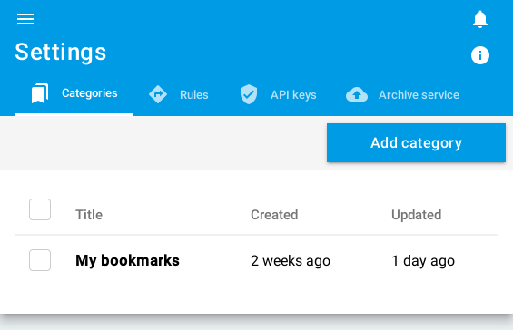

+++
title = "Categories"
description = "Manage categories"
weight = 1
+++

To manage categories, go to [the configuration screen](https://readflow.app/settings/categories):

A category is a simple title.

Once you have created your categories, you can use the [rule engine](.../rules).
