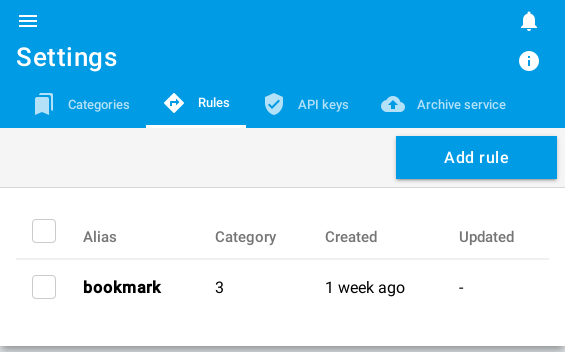
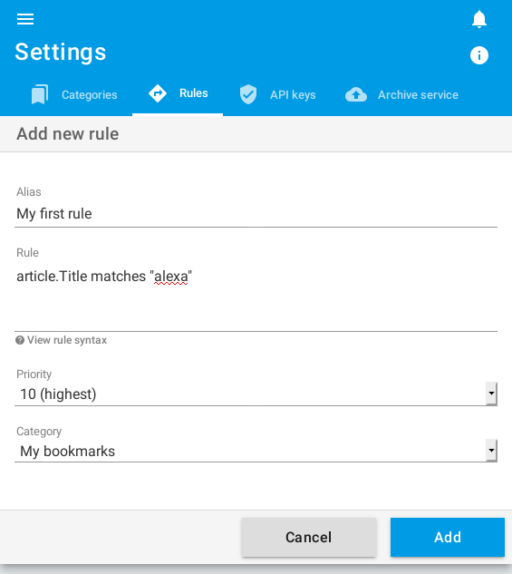

+++
title = "The rule engine"
description = "Use the rule engine to organize your reading flows"
weight = 2
+++

When adding an article, the rule engine will be activated and apply the rules ordered by priority.
At the first validated rule, the article is placed in the target category.
If no rules match then the article will not have a category.

To manage the rules, go to[the configuration screen](https://readflow.app/settings/rules):



Click on the `Add rule` button to add a rule:



A rule is:

- An alias (its visual identifier)
- A priority (its order of execution)
- A definition
- And a target category

## The definition of a rule

The definition of a rule is a pseudo code whose result must be true or false.

Within the rule it is possible to refer to the article (`article`) and the API key (`key`).

An article contains the following attributes:

- `article.Title`: its title
- `article.Text`: its text content (le résumé)
- `article.HTML`: its HTML content
- `article.URL`: ist source URL
- `article.Image`: its illustration

### Syntax

#### Operators

- `==` (equal)
- `!=` (non equal)
- `matches` (validate a regular expression)
- `not ("foo" matches "bar")` (does not validate a regular expression)

#### Logical operators

- `not` or `!`
- `and` or `&&`
- `or` or `||`

#### Other operators

- `~` (concatenation)
  *Example:* `'Harry' ~ ' ' ~ 'Potter'` will be `Harry Potter`
- `in`
- `not in`
  *Example:* `key in ["test", "bookmarklet"]`

#### Functions

- `len` (length of the character string)
   *Example:* `len(article.Text) == 0`

### Examples:

Classify articles whose API key is "foo":

```js
key == "foo"
```

Classify items with API key "foo" or "bar":

```js
key == "foo" || key == "bar"
// Peut aussi s'écrire:
key in ["foo", "bar"]
```

Classify articles with titles containing "Amazon" and "Alexa":

```js
article.Title matches "Amazon" and article.Title matches "Alexa"
```

Classify items that come from CNN:

```js
article.URL matches "^https://edition.cnn.com"
```
