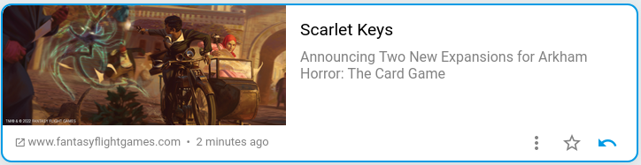

+++
title = "Read"
description = "Unroll the reading flow"
weight = 2
+++

The reading flows are organized as follows:

- The main flow: It includes all the unread articles.
- Categories: They allow you to split your reading flow.
- Stared articles: They include the items you have kept.
- The history: It includes all the articles read.

To mark an article as read, you must click on the mark button.
If you are using a mobile phone, you can also swipe the article to the left.
It will separate and be marked as read.

The article can then be found in the history.

It can be put back into the reading flow, from the history, by clicking again on the marking button.

If you are interested in an article, you can click on its title or illustration to open its entire content.
You will also find in this page the marking button.

The history is regularly cleaned of its oldest articles.

If you wish to keep an article you can click on the star.
It will be kept whatever is its reading state.
