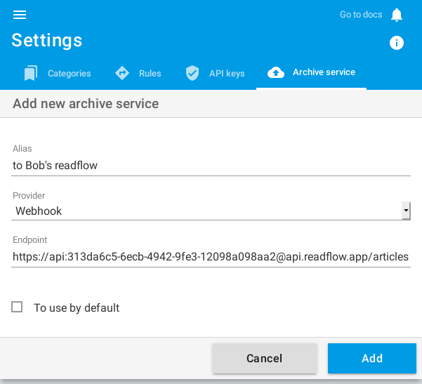
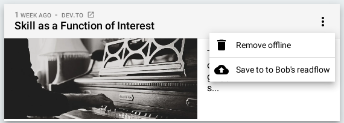

+++
title = "Webhook"
description = "Archiver des articles vers un webhook"
weight = 1
+++


A webhook is a simple HTTP access point using POST.

## Format

By default, the article is sent as a JSON with the following format:

```json
{
  "title": "The title",
  "text": "Text content (the summary)",
  "html": "HTML content",
  "url": "origin URL of the article",
  "image": "URL of the article illustration",
  "published_at": "article publication date"
}
```

It is possible to personalize the content sent.

You can specify its type:

- JSON
- HTML
- or Text

And you can specify its format using the [Golang templates](https://golang.org/pkg/text/template/) syntax.

To make it simple, you can access the JSON document properties above but prefix them with a dot and a capital letter between two brackets.
For example, the `title` property can be accessed with the `{{.Title}}` syntax.

## Kinematics

To add a webhook, you must[configure your archiving service](https://readflow.app/settings/archive-services):


Click on the `Add archive service` button.
The service creation page opens:



1. Enter an alias
1. Choose `webhook` as service provider
1. Configure the webhook URL
1. Click on the checkbox if you want to make it your default service

Once configured, you will see a new entry in the context menu of the article:



You can now send an article to a HTTP endpoint.

## Share an article with another readflow

It should be noted that the JSON format used is compatible with the readflow integration API.
It is therefore possible to configure a webhook to send the article to another account or readflow instance.

To do this you must configure the URL as follows: `https://api:<API_KEY>@api.readflow.app/articles`

By replacing `<API_KEY>` with an API key of the target account.

## Send an article to Mattermost or Slack

Let's say you want to send an article to a Mattermost Webhook.
You'll need to create a JSON document with a `text' property like this:

```json
{
	"text": ":tada: {{.Title}} (<{{.URL}}|more>) cc @all",
}
```
