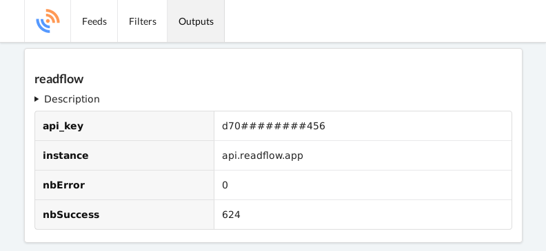

+++
title = "RSS feed with feedpushr"
description = "Use feedpushr to integrate RSS feeds"
weight = 2
+++


[Feedpushr](https://github.com/ncarlier/feedpushr) is a powerful open source RSS feed aggregator able to process and send articles to third party services.
And among these services, we have readflow.

To use readflow with feedpushr, you must use and configure its plugin:

```bash
$ # Set readflow URL
$ export APP_READFLOW_URL=https://api.readflow.app
$ # Set API key
$ export APP_READFLOW_API_KEY=d70*************456
$ # Start feedpushr
$ feedpushr --log-pretty --plugin ./feedpushr-readflow.so --output readflow://
```

or with Docker:

```bash
$ cat conf.env
APP_PLUGINS=feedpushr-readflow.so                                           
APP_READFLOW_URL=https://api.readflow.app
APP_READFLOW_API_KEY=<YOUR API KEY>
APP_OUTPUTS=readflow://
APP_FILTERS=fetch://#fetch,minify://#minify
APP_LOG_PRETTY=true
```

```bash
$ docker run -d --name feedpushr -p 8080:8080 --env-file=conf.env ncarlier/feedpushr-contrib
```

You should see this on the feedpushr UI (http://localhost:8080/ui):



You can then import your OPML subscriptions into feedpushr and see your articles in readflow.
