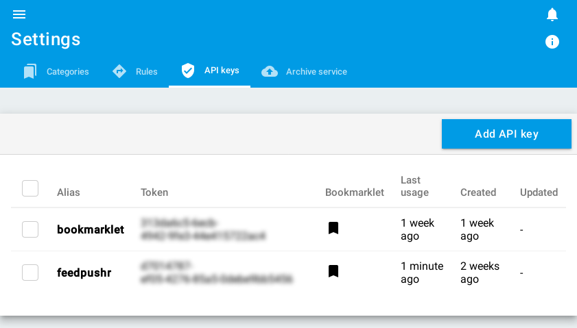

+++
title = "API keys"
description = "Manage API keys"
weight = 1
+++

To create an API key, go to [the API key configuration screen](https://readflow.app/settings/api-keys):

By clicking on the `Add API key` button you open the following window:

Enter an alias for this key.

The alias is used (among other things) by the rule engine.
