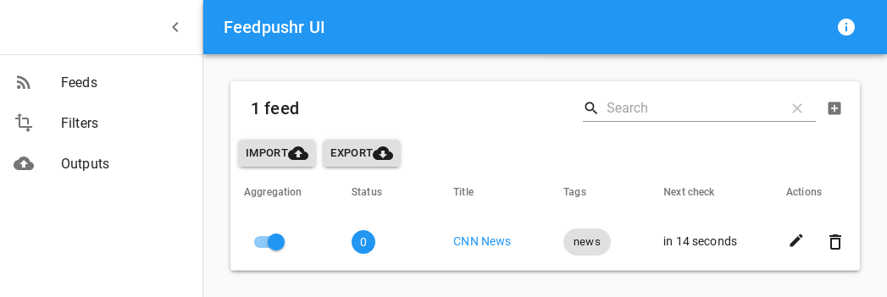
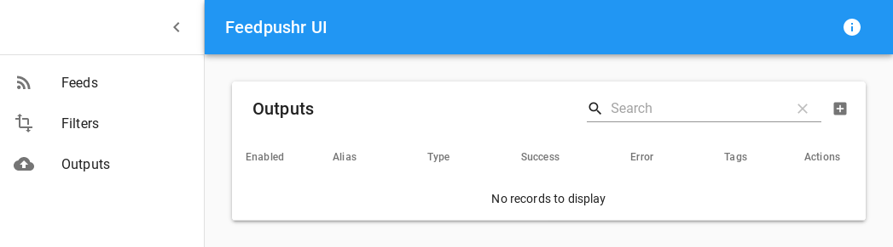
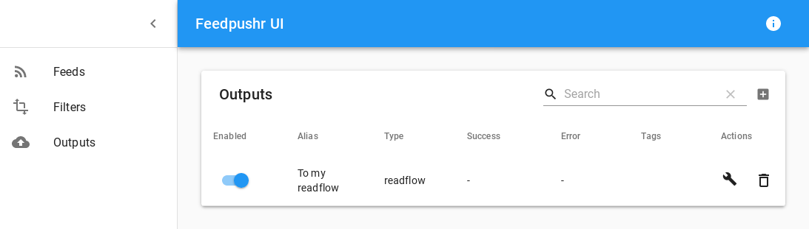

+++
title = "Flux RSS avec feedpushr"
description = "Utilisation de feedpushr pour intégrer des flux RSS"
weight = 1
+++


[Feedpushr](https://github.com/ncarlier/feedpushr) est un puissant aggrégateur Open Source de flux RSS capable de traiter et envoyer les articles vers des services tiers.
Et parmi ces services, nous avons readflow.

## Lancer Feedpushr

Pour exécuter Feedpushr vous avez plusieurs possibilités:

Utiliser [Go](https://golang.org/) pour compiler et installer le binaire:

```bash
$ go get -v github.com/ncarlier/feedpushr
$ feedpushr --log-pretty --log-level debug
```

Ou télécharger le binaire depuis le [dépot de source](https://github.com/ncarlier/feedpushr/releases):

```bash
$ sudo curl -s https://raw.githubusercontent.com/ncarlier/feedpushr/master/install.sh | bash
$ feedpushr --log-pretty --log-level debug
```

Ou utiliser [Docker](https://www.docker.com):

```bash
$ docker run -d --name=feedpushr ncarlier/feedpushr feedpushr --log-pretty --log-level debug
```

Vous pouvez également lancer Feedpushr en *"mode bureau"* en cliquant sur l'exécutable `feedpushr-agent`.
Feedpushr sera alors accessible depuis un icone dans votre bare des tâches.

## Configurer Feedpushr

Vous devriez pouvoir acceder à [la console Web de Feedpushr](http://localhost:8080/ui/) :



Aller sur la page de configuration des sorties (`Outputs`):



Cliquer sur le bouton `+` pour ajouter une sortie et choisir le composant `readflow`.

Configurer le composant comme suit:

- `Alias`: Saisir une courte description (ex: `Vers mon readflow`).
- `URL`: Laisser ce champ vide pour utiliser https://readflow.app ou saisir l'URL de l'API si vous utilisez une autre instance.
- `API KEY`: Saisir le token [du webhook entrant de readflow](../../incoming-webhook).


Activer la nouvelle sortie:



Vous pouvez ensuite importer vos abonnements OPML dans feedpushr et voir des nouveaux articles dans readflow.
