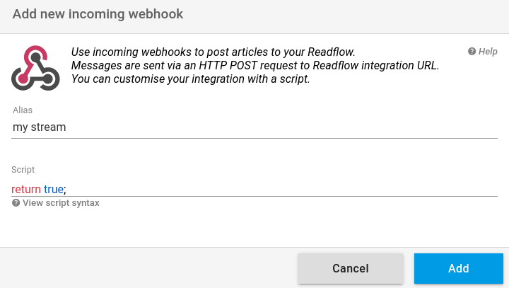

+++
title = "Webhook entrant"
description = "Ajouter du contenu à readflow depuis des services tiers"
weight = 1
+++

Un webhook entrant permet à un service tiers de créer du contenu dans readflow.

Pour ajouter un webhook entrant, allez sur [l'écran de configuration des intégrations](https://readflow.app/settings/integrations).

Cliquez sur le bouton `Add` pour ajouter un webhook entrant:

Saisissez un alias pour votre webhook.

L'alias peut être utilisé par le moteur de règle pour classer les articles venant par ce webhook.

Le service utilisant le webhook doit implémenter l'[API d'intégration](integration-api) de readflow:

{}
