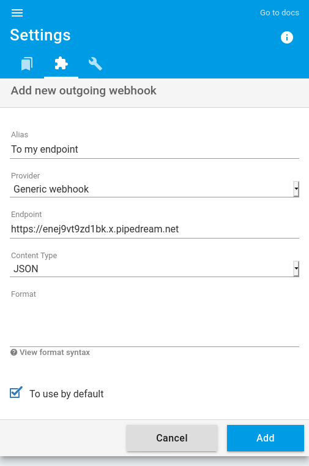
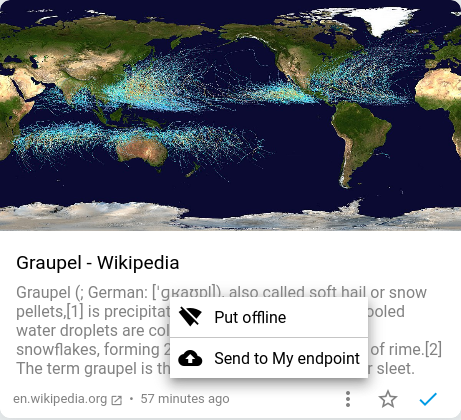

+++
title = "Webhook générique"
description = "Envoyer des articles vers un webhook générique"
weight = 1
+++


Un webhook générique est un simple point d'accès HTTP accessible en POST.

Vous pouvez personnaliser l'appel du webhook en spécifiant les en-têtes et le contenu du corps de la requête HTTP.

## En-têtes

Par défaut, readflow configure le type de contenu :

```http
Content-Type: application/json
```

Vous pouvez modifier ou ajouter vos propres en-têtes. Ex :

```http
Content-Type: text/plain
X-API-Key: 5ebe2294ecd0e0f08eab7690d2a6ee69
```

## Le corps

Par défaut, l'article est envoyé en JSON selon le format suivant :

```json
{
  "title": "Le titre",
  "text": "Le text (le résumé)",
  "html": "Le contenu HTML",
  "href": "L'URL de l'article sur readflow",
  "url": "L'URL d'origine",
  "image": "L'URL de l'illustration",
  "published_at": "La date de publication"
}
```

> Si le coprs est vide, readflow force `Content-Type` à `application/json`

Il est possible de personnaliser le contenu via un template.

### Templating

Le moteur de template est très simple et permet de manipuler les propriétés de l'article :

- `{{title}}`: Le titre
- `{{text}}`: Le texte
- `{{html}}`: Le contenu HTML
- `{{href}}`: L'URL de l'article sur readflow
- `{{url}}`: L'URL d'origine
- `{{image}}`: L'URL de l'illustration
- `{{published_at}}`: La date de publication

Il est également possible de modifier une propriété avec une fonction de filtre :

- `{{ title | json }}`: echapement JSON de la valeur
- `{{ title | urlquery }}`: echapement URL de la valeur
- `{{ title | bas64 }}`: encodeage en base 64 de la valeur
- `{{ html | html2text }}`: conversion du code HTML en texte simple

Exemple:

```django
{
	"text": ":tada: {{title | json}} (<{{url}}|plus>) cc @all",
}
```

## Cinématique

Pour ajouter un webhook générique, vous devez [configurer votre webhook sortant](https://readflow.app/settings/integrations):


Cliquer sur le bouton `Add` pour ajouter un webhook sortant.
La page d'ajout de webhook s'ouvre:



1. Saisissez un alias
1. Choisissez `generic` comme fournisseur de service
1. Configurez l'URL du webhook
1. Configurer les en-têtes HTTP
1. Personnaliser le corps de la requête HTTP selon les besoins
1. Cochez la case si vous souhaitez en faire votre service par défaut

Une fois configuré, vous verrez une nouvelle entrée dans le menu contextuel des articles:



Vous pouvez désormais envoyer un article vers un point d'accès HTTP.
