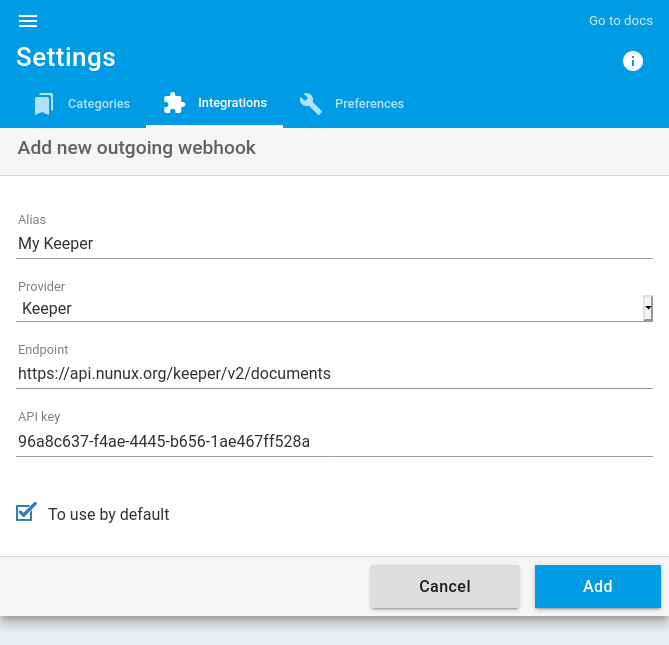

+++
title = "Nunux Keeper"
description = "Envoyer des articles vers Nunux Keeper"
weight = 2
+++

[Nunux Keeper](https://keeper.nunux.org) est un service Open Source d'archivage d'article.

Pour utiliser readflow avec Nunux Keeper vous devez au préalable obtenir [une clé d'API dans Nunux Keeper](https://app.nunux.org/keeper/settings/api-key):

Une fois obtenue, vous pouvez [configurer votre webhook sortant](https://readflow.app/settings/integrations):

Cliquer sur le bouton `Add` pour ajouter un webhook sortant.
La page d'ajout de webhook s'ouvre:

1. Saisissez un alias
1. Choisissez `Nunux Keeper` comme fournisseur
1. Configurez si nécessaire l'URL du service
1. Coller votre clé d'API
1. Cochez la case si vous souhaitez en faire votre service par défaut

Le service d'archivage par défaut peut être invoqué via le racourci clavier `shift+s` lors de la visualisation d'un article.

Une fois configuré, vous verrez une nouvelle entrée dans le menu contextuel des articles.

Vous pouvez désormais envoyer un article vers Nunux Keeper.
