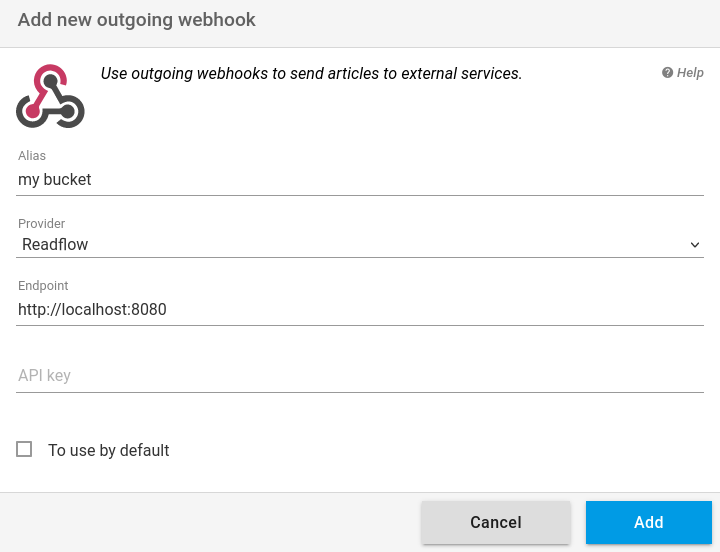

+++
title = "Readflow"
description = "Envoyer des articles vers readflow"
weight = 3
+++

Vous pouvez envoyer des articles vers un autre readflow.
Pour cela, [configurer votre webhook sortant](https://readflow.app/settings/integrations):

Cliquer sur le bouton `Add` pour ajouter un webhook sortant.
La page d'ajout de webhook s'ouvre:

1. Saisissez un alias
1. Choisissez `Readflow` comme fournisseur de service
1. Configurez si besoin l'URL du service
1. Saisissez la clé d'API du webhook entrant
1. Cochez la case si vous souhaitez en faire votre service par défaut

Le service d'archivage par défaut peut être invoqué via le racourci clavier `shift+s` lors de la visualisation d'un article.

Une fois configuré, vous verrez une nouvelle entrée dans le menu contextuel des articles.

Vous pouvez désormais envoyer un article vers readflow.
