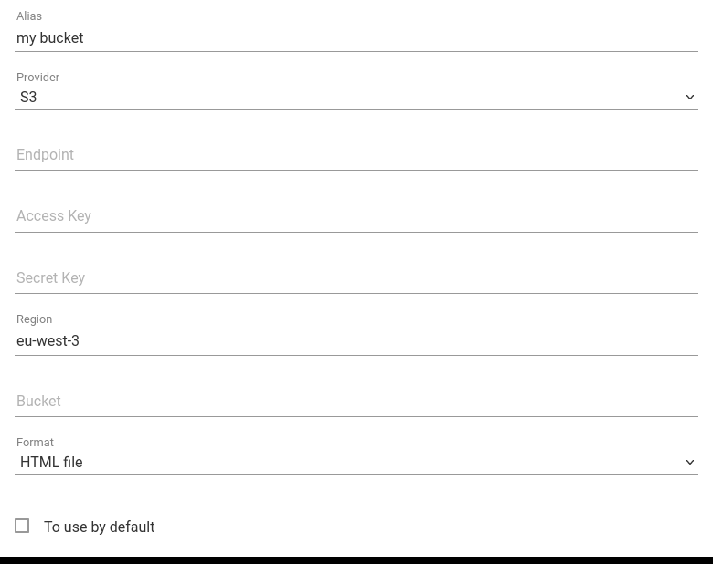

+++
title = "Bucket S3"
description = "Envoyer des articles vers un bucket S3"
weight = 3
+++

[Un bucket S3](https://en.wikipedia.org/wiki/Amazon_S3) est un service de stockage de fichier en ligne.

Vous pouvez [configurer votre webhook sortant](https://readflow.app/settings/integrations):

Cliquer sur le bouton `Add` pour ajouter un webhook sortant.
La page d'ajout de webhook s'ouvre:

1. Saisissez un alias
1. Choisissez `S3` comme fournisseur de service
1. Configurez l'URL du service
1. Configurez les credentials (Access and Secret Key)
1. Saisissez votre région
1. Saisissez le nom de votre bucket
1. Choisissez le format de stockage
1. Cochez la case si vous souhaitez en faire votre service par défaut

Le service d'archivage par défaut peut être invoqué via le racourci clavier `shift+s` lors de la visualisation d'un article.

Une fois configuré, vous verrez une nouvelle entrée dans le menu contextuel des articles.

Vous pouvez désormais envoyer un article vers un bucket S3.
