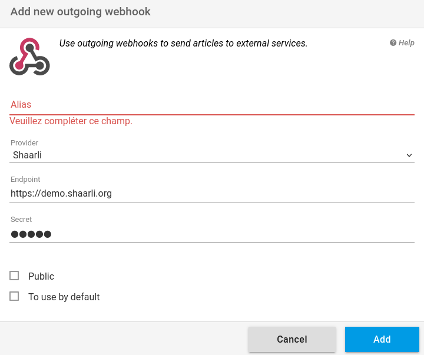

+++
title = "Shaarli"
description = "Send articles to Shaarli"
weight = 3
+++

[Shaarli](https://github.com/shaarli/Shaarli) est un service de partage de signets personnel, minimaliste, super rapide et sans base de données.

Pour utiliser readflow avec Shaarli, vous devez d'abord définir le [secret API](https://shaarli.readthedocs.io/en/master/Shaarli-configuration/#shaarli-configurationhttps://doc.wallabag.org/fr/developer/api/oauth.html):

Une fois cela fait, vous pouvez [configurer votre webhook sortant](https://readflow.app/settings/integrations):

Cliquer sur le bouton `Add` pour ajouter un webhook sortant.
La page d'ajout de webhook s'ouvre:

1. Saisissez un alias
1. Choisissez `Shaarli` comme fournisseur de service
1. Configurez l'URL du service
1. Saisissez votre secrte d'API
1. Cochez la case si vous souhaitez en faire votre service par défaut

Le service d'archivage par défaut peut être invoqué via le racourci clavier `shift+s` lors de la visualisation d'un article.

Une fois configuré, vous verrez une nouvelle entrée dans le menu contextuel des articles.

Vous pouvez désormais envoyer un article vers Shaarli.
