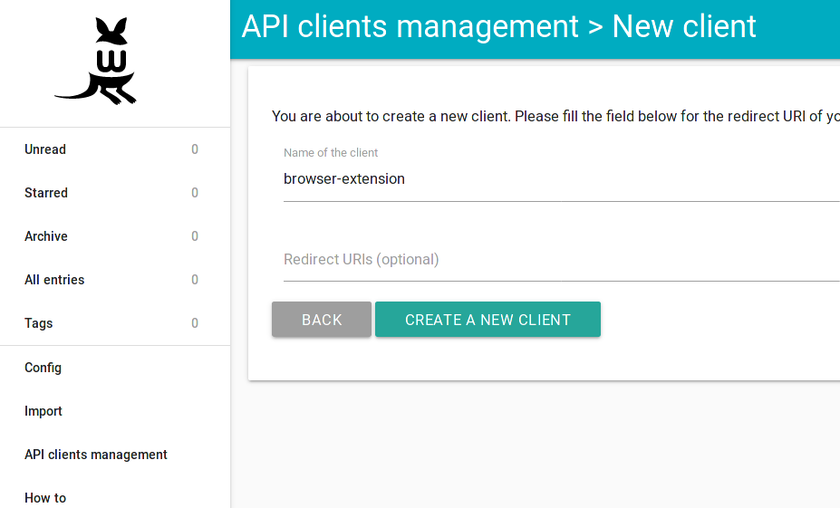

+++
title = "Wallabag"
description = "Envoyer des articles vers Wallabag"
weight = 3
+++

[Wallabag](https://www.wallabag.org) est un service qui sauvegarde des articles et vous permet de les lire plus tard.

Pour utiliser readflow avec Wallabag vous devez au préalable créer [un client d'API](https://doc.wallabag.org/fr/developer/api/oauth.html):

Une fois obtenue, vous pouvez [configurer votre webhook sortant](https://readflow.app/settings/integrations):

Cliquer sur le bouton `Add` pour ajouter un webhook sortant.
La page d'ajout de webhook s'ouvre:

1. Saisissez un alias
1. Choisissez `Wallabag` comme fournisseur de service
1. Configurez si nécessaire l'URL du service
1. Coller votre client ID et secret
1. Saisissez vos crédentials
1. Cochez la case si vous souhaitez en faire votre service par défaut

Le service d'archivage par défaut peut être invoqué via le racourci clavier `shift+s` lors de la visualisation d'un article.

Une fois configuré, vous verrez une nouvelle entrée dans le menu contextuel des articles.

Vous pouvez désormais envoyer un article vers Wallabag.
