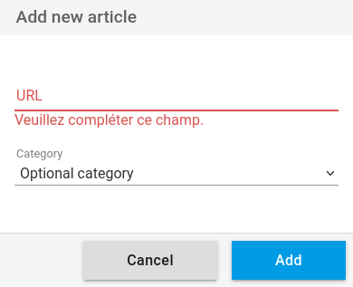

+++
title = "Ajouter un article"
description = "Ajouter un article depuis l'interface Web"
weight = 1
+++

Vous avez un bouton `+` sur la page du flux de lecture principale et sur les pages des catégories:

En cliquant sur ce bouton vous ouvrez une fenêtre d'ajout de lien:

Saisissez un lien valide.
Si la page est lisible elle sera ajoutée au flux de lecture.

Une page ne peut être ajoutée qu'une fois dans un flux.

**Attention:** Il est possible que la page ne soit pas lisible par le système d'extraction de contenu.
Ceci est due, le plus souvent des cas, à une obfuscation volontaire des sites pour prévenir de ce genre d'extraction.
Dans ce cas, uniquement les données [Open Graph][open-graph] sont extraites.

[open-graph]: https://fr.wikipedia.org/wiki/Open_Graph_Protocol
