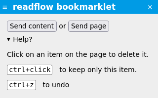

+++
title = "Les bookmarklets"
description = "Ajouter un article pendant la navigation web en utilisant une bookmarklet"
weight = 4
+++

Pour créer une bookmarklet, vous devez au préalable avoir [créé un webhook entrant](../../integrations/incoming-webhook).

Une fois le webhook créé, vous pouvez glisser déposer l'icône de la bookmarklet  dans les favoris de votre navigateur.

Vous pouvez renommer la bookmarklet comme bon vous semble.

Lors de votre navigation Web, si une page vous intéresse, cliquez sur le lien dans vos favoris.

Une petite fenêtre doit apparaitre sur la page:

Elle vous permet d'envoyer toute ou partie de la page.
Vous pouvez cliquer sur les éléments de la page qui ne vous intéressent pas pour les retirer (ou garder la touche `ctrl` enfoncée pour faire le contraire).
