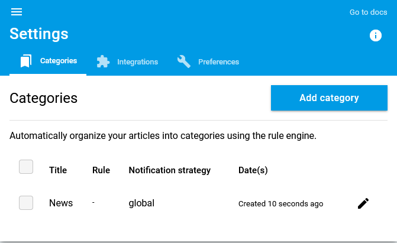
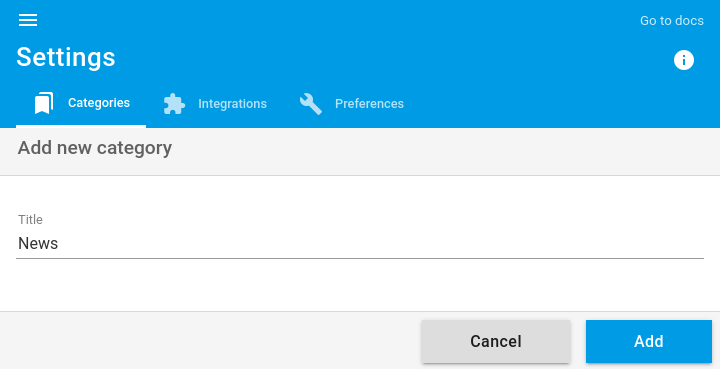

+++
title = "Catégories"
description = "Utiliser les catégories pour organiser vos flux de lecture"
weight = 2
+++

Dans readflow vous pouvez scinder vos flux de lectures en catégories.

## Catégories

Pour gérer les catégories, allez sur [l'écran de configuration](https://readflow.app/settings/categories):

Vous pouvez ajouter une catégorie en cliquant sur le bouton `Add category`.

Une catégorie est définie par un simple titre.

Vous pouvez maintenant affecter un article à cette catégorie.
