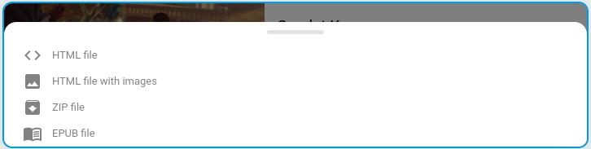

+++
title = "Télécharger un article"
description = "Télécharger un article depuis l'interface Web"
weight = 3
+++

Il est possible de télécharger un article sur son appareil.
Ceci permet de consulter ou archiver cet article en toute liberté.

Cliquez sur le menu contextuel pour accéder au bouton téléchargement d'un article:

Vous pouvez ensuite choisir le format de fichier qui vous convient:

