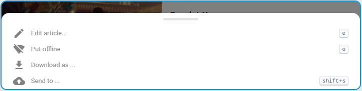
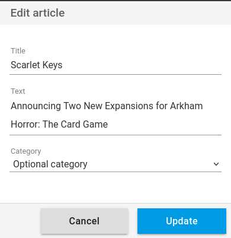

+++
title = "Editer un article"
description = "Editer un article depuis l'interface Web"
weight = 1
+++

Il est possible de modifier partiellement un article.
Ceci permet d'améliorer votre organisation et d'ajouter vos propres notes.

Cliquez sur le menu contextuel pour accéder au bouton d'édition d'un article:

Vous pouvez ensuite modifier:

- le titre
- le texte
- et la catégorie

Le titre et le texte peuvent contenir des hashtags (mot-clé précédé d'un « # »).
Les hashtags ainsi ajoutés sont associés à l'article et peuvent être utilisés dans le moteur de recherche.

