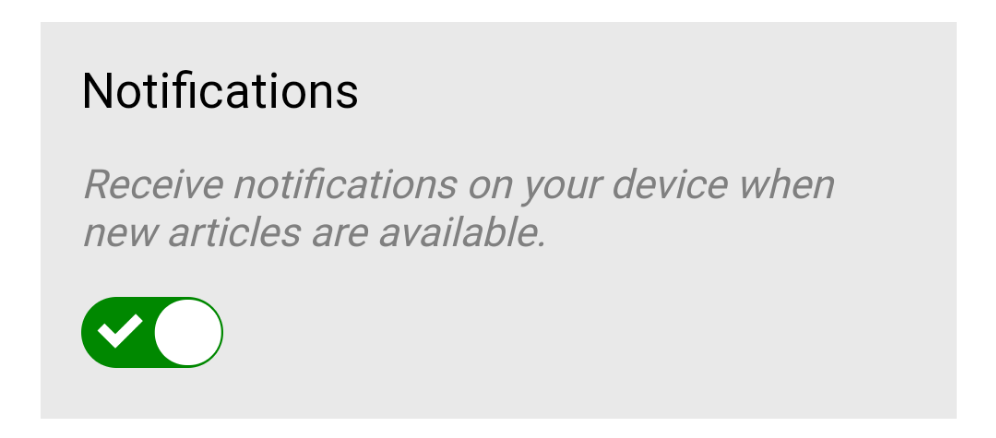
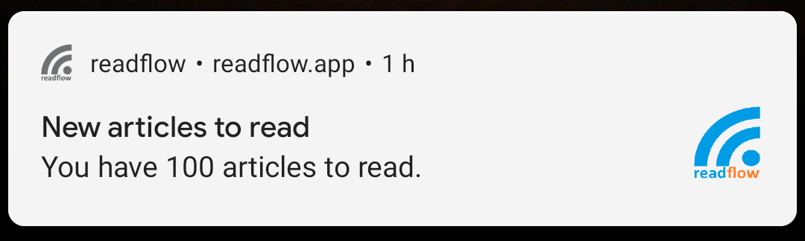

+++
title = "Les notifications"
description = "Activer la notification du flux de lecture"
weight = 6
+++

Il est possible de recevoir des notifications lorsque le flux de lecture contient des articles.

Pour souscrire aux notifications, vous devez vous rendre sur [l'écran des préférences](https://readflow.app/settings/preferences) et activer le bouton des notifications.

Votre navigateur doit vous demander l'autorisation d'utiliser les notifications.
Vous devez accepter pour pouvoir souscrire aux notifications.

Vous pouvez désactiver les notifications à tout moment.

{}
Les notifications sont attachées au navigateur et appareil utilisés.
Si vous changez de navigateur ou d'appareil, vous devez renouveler l'opération pour recevoir des notifications dessus.
{}

Vous recevrez par la suite des notifications au fur et à mesure que votre flux de lecture se remplit:

