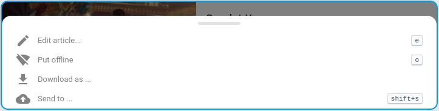

+++
title = "Le mode hors-ligne"
description = "Utilisation du mode hors-ligne"
weight = 5
+++

Il est possible de conserver un article en mode hors-ligne.
Ceci permet de consulter l'article même en cas de mauvaise couverture réseau.

**Attention:**
Il n'y a pas pour le moment de service de synchronisation des articles hors-ligne.
L'article est conservé sur l'appareil utilisé à l'instant T.
Si vous changez d'appareil, vous ne retrouverez pas l'article.

Cliquez sur le menu contextuel pour accéder au bouton de mise hors-ligne d'un article:

Vous pouvez ensuite consulter la [page des articles hors-ligne](https://readflow.app/offline).

Cette page ressemble à la page de flux de lecture à l'exception qu'il n'y a pas de notion de marquage.

Vous pouvez supprimer un article hors-ligne depuis son menu contextuel.

**Attention:**
Un article hors-ligne supprimé est définitivement perdu sauf s'il est encore dans votre flux de lecture.

