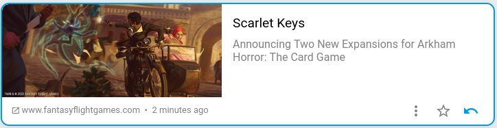

+++
title = "Lire"
description = "Dépiler le flux de lecture"
weight = 2
+++

Les flux de lecture sont organisés de la façon suivante:

- Le flux principal: Il regroupe tous les articles non lus.
- Le flux de lecture: Il regroupe les articles marqués comme à lire.
- Les catégories: Elles permettent d'organiser votre flux de lecture.
- Les favoris: Ils regroupent les articles que vous avez conservé.
- L'historique: Il regroupe tous les articles lus.

Pour marquer un article comme lu, vous devez cliquer sur le bouton de marquage.
Si vous utiliser un mobile, vous pouvez également faire glisser l'article sur la gauche.
Il disparaîtra et sera marqué comme lu.

L'article disparaît alors du flux de lecture et peut être retrouvé dans l'historique.

Il est possible de le remettre dans le flux de lecture depuis l'historique en cliquant à nouveau sur le bouton de marquage.

Si un article vous intéresse vous pouvez cliquer sur son titre ou son illustration pour ouvrir l'intégralité de son contenu.
Vous retrouvez dans cette page le bouton de marquage.

L'historique est régulièrement vidée de ses articles les plus anciens.

Si vous voulez lire cet article plus tard vous pouvez le marquer comme `à lire`. Il sera alors déplacé dans le flux de lecture.

Si vous souhaitez conserver un article vous pouvez cliquer sur l'étoile.
Il sera conservé quelque soit sont état de lecture.
