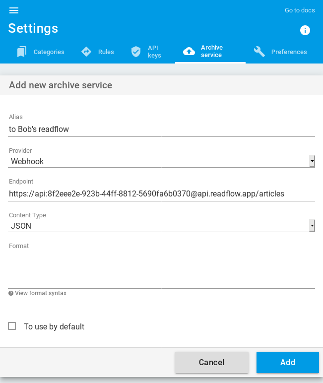

+++
title = "Webhook"
description = "Archiver des articles vers un webhook"
weight = 1
+++


Un webhook est un simple point d'accès HTTP accessible en POST.

## Format

Par défaut, l'article est envoyé en JSON selon le format suivant:

```json
{
  "title": "Le titre",
  "text": "Le text de l'article (le résumé)",
  "html": "Le contenu HTML de l'article",
  "url": "L'URL d'origine de larticle",
  "image": "L'URL de l'illustration de l'image",
  "published_at": "La date de publication de l'article"
}
```

Il est possible de personnaliser le contenu envoyé.

Vous pouvez spécifier son type:

- JSON
- HTML
- ou Texte

Et vous pouvez spécifier son format en utilisant la syntaxe des [templates de Golang](https://golang.org/pkg/text/template/).

Pour faire simple, vous avez accès aux propriétés du document JSON ci-dessus mais en les préfixant avec un point et une majuscule le tout entre deux accolades.
Par exemple, la propriété `title` est accessible avec la syntaxe `{{.Title}}`.

## Cinématique

Pour ajouter un webhook, vous devez [configurer votre service d'archivage](https://readflow.app/settings/archive-services):


Cliquez sur le bouton `Add archive service`. La page d'ajout de service s'ouvre:



1. Saisissez un alias
1. Choisissez `webhook` comme fournisseur de service
1. Configurez l'URL du webhook
1. Cochez la case si vous souhaitez en faire votre service par défaut

Une fois configuré, vous verrez une nouvelle entrée dans le menu contextuel des articles:


Vous pouvez désormais envoyer un article vers un point d'accès HTTP.

## Partager un article avec un autre readflow

Il est à noter que le format JSON utilisé est compatible avec l'API d'intégration de readflow.
Il est donc possible de configurer un webhook pour envoyer l'article vers un autre compte ou une autre instance readflow.

Pour ce faire vous devez configurer l'URL comme ceci: `https://api:<API_KEY>@api.readflow.app/articles`

En remplacent `<API_KEY>` par une API key du compte cible.

## Evoyer un article vers Mattermost ou Slack

Imaginons que vous voulez envoyer un article à un Webhook Mattermost.
Vous allez devoir créer un document JSON avec une propriété `text` comme ceci:

```json
{
	"text": ":tada: {{.Title}} (<{{.URL}}|voir plus>) cc @all",
}
```
